# LilleStops

## Screen

  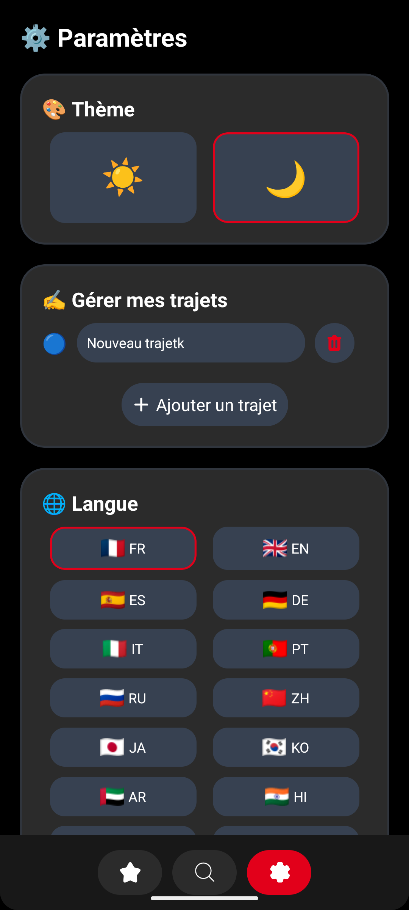
  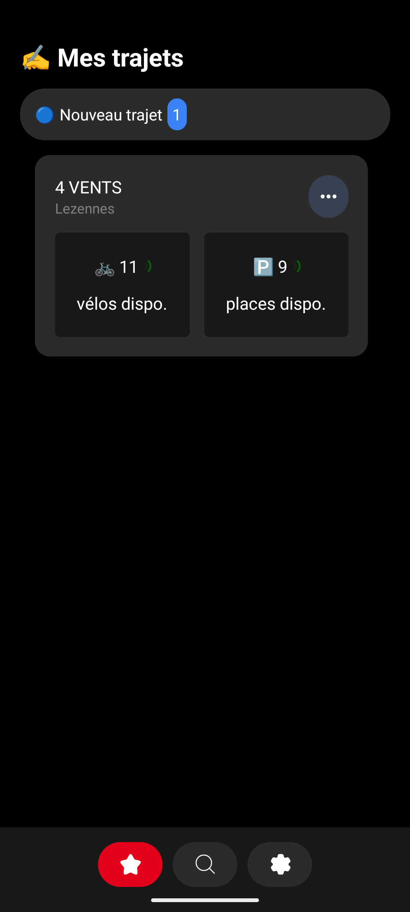
  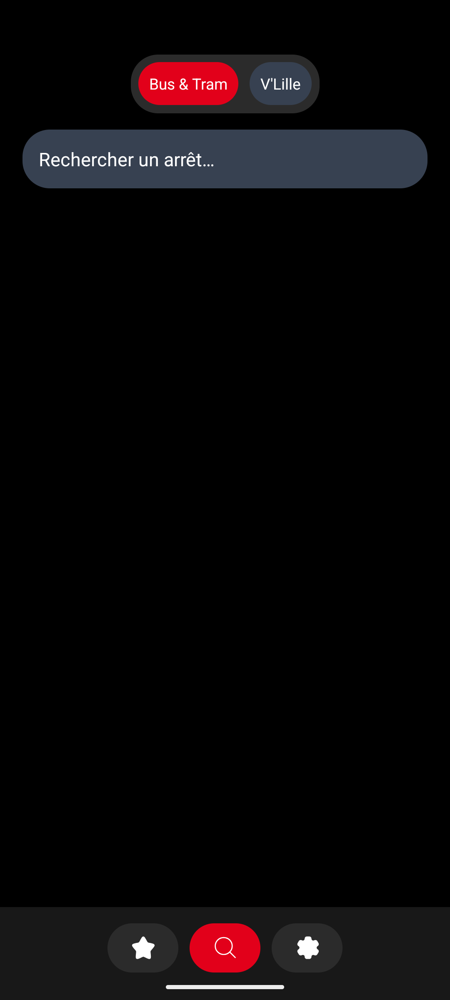
  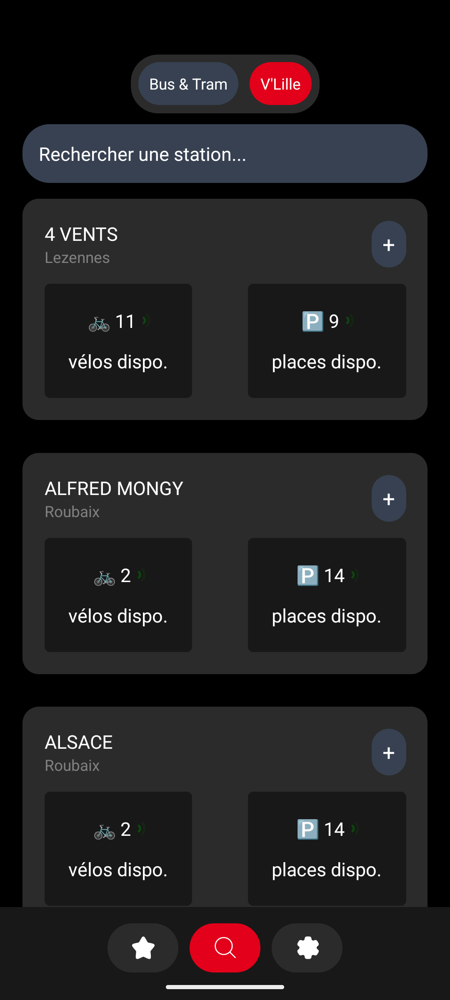

  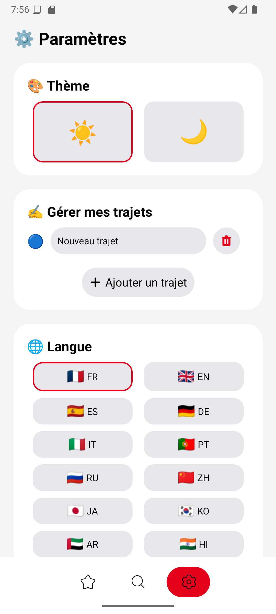
  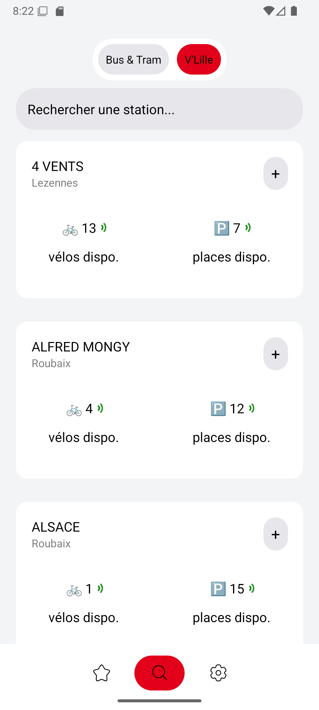
  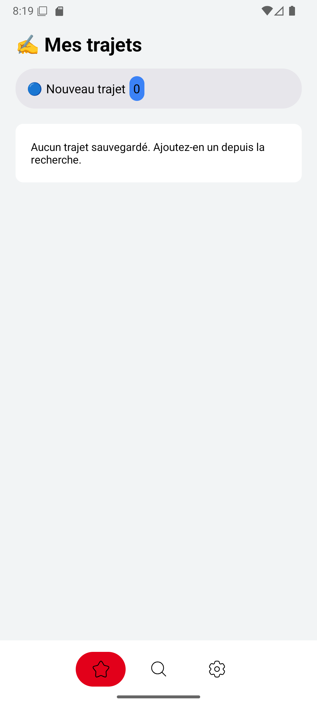
  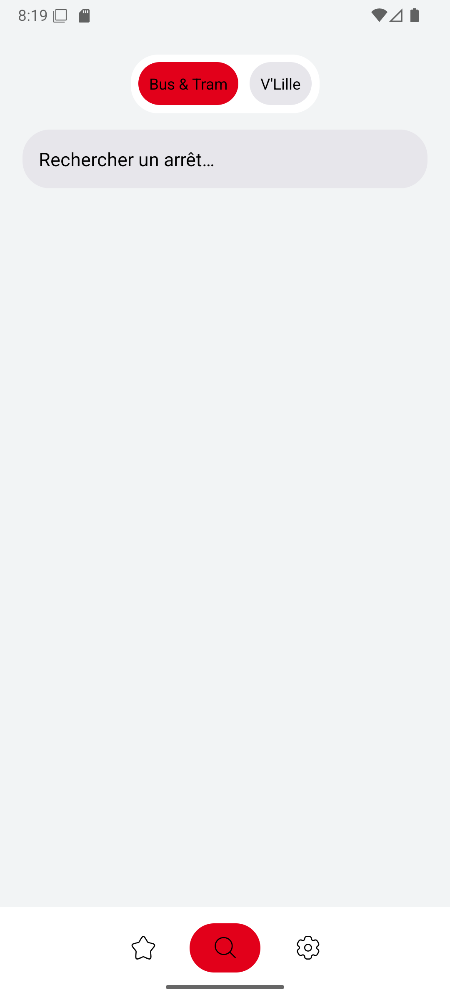

## languages
| Flag                               | Name            |
|------------------------------------|-----------------|
|  | Français        |
|  | Anglais         |
| 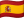 | Espagnol        |
|  | Allemand        |
|   | Italien         |
| 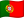 | Portugais       |
| 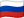    | Russe           |
|   | Chinois         |
|  | Japonais        |
|    | Coréen          |
|     | Arabe           |
| 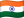    | Hindi           |
| 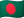  | Bengali         |
|  | Polonais        |
|  | Néerlandais     |
|      | Turc            |
| 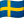  | Suédois         |
| 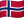 | Norvégien       |
|     | Danois          |
|    | Finnois         |
|       | Grec            |
|       | Thaï            |
|  | Vietnamien      |
|    | Tchèque         |
| 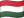  | Hongrois        |
| 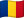    | Roumain         |
| 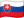   | Slovaque        |
|      | Hébreu          |
| 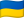  | Ukrainien       |
| 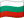    | Bulgare         |
|      | Letton          |
| 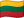  | Lituanien      |
| 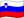    | Slovène         |
|    | Estonien        |
| 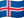  | Islandais       |
| 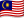     | Malais          |
|     | Maltais         |
|     | Tagalog         |
|     | Swahili         |
| 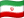      | Persan          |
|       | Khmer           |
|      | Birman          |
|   | Amharique       |
|    | Népalais        |
|    | Pendjabi        |
| 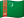    | Turkmène        |
|       | Ouzbek          |
|      | Sanskrit |
|      | Yiddish                |